# Enterprise Next.js 15 Frontend Architecture Plan

This plan establishes a scalable, production-ready frontend architecture for the Anamta Institute web application. It enforces strict separation of concerns between React UI components, feature-specific Hooks (data fetching), and Services (business logic).

To keep the development clean, structured, and manageable, **we will implement the project phase-by-phase**, stopping for your review and approval after each phase.

---

## Folder Structure Diagram

```mermaid
graph TD
  client[client] --> app[app]
  client --> components[components]
  client --> graphql[graphql]
  client --> hooks[hooks]
  client --> services[services]
  client --> providers[providers]
  client --> lib[lib]
  client --> utils[utils]
  client --> constants[constants]
  client --> types[types]
  client --> middleware[middleware.ts]

  components --> ui[ui]
  components --> layout[layout]
  components --> forms[forms]
  components --> tables[tables]
  components --> cards[cards]
  components --> charts[charts]

  graphql --> queries[queries]
  graphql --> mutations[mutations]
  graphql --> fragments[fragments]
  graphql --> types_gql[types]
  graphql --> generated[generated]

  hooks --> auth_h[auth]
  hooks --> students_h[students]
  hooks --> courses_h[courses]

  services --> auth_s[auth]
  services --> students_s[students]
  services --> courses_s[courses]
```

---

## Phase-by-Phase Implementation Roadmap

### Phase 1: Package Installations
- Install critical dependencies in the `client/` directory:
  - Apollo Client (`@apollo/client`, `graphql`)
  - Form & Validation (`react-hook-form`, `zod`, `@hookform/resolvers`)

---

### Phase 2: Lib, Env, Utilities, & Constants (Foundation)
Create configuration files:
- **[env.ts](file:///c:/zaibi's project/client/lib/env.ts)**: Typesafe validation of environment variables using Zod.
- **[cookies.ts](file:///c:/zaibi's project/client/lib/cookies.ts)**: Reusable client/server helper to read, write, and delete cookies (compliant with Next.js App Router).
- **[routes.ts](file:///c:/zaibi's project/client/constants/routes.ts)**: Centralized routes list for navigation and middleware route protection.
- **[helpers.ts](file:///c:/zaibi's project/client/utils/helpers.ts)**: Shared utilities (error formatters, etc.).

---

### Phase 3: Apollo Client & Providers Setup
Set up the GraphQL state engine and core app wraps:
- **[apollo-client.ts](file:///c:/zaibi's project/client/lib/apollo-client.ts)**: Multi-link Apollo setup combining `ErrorLink` (automatic token refreshing/logout), `RetryLink` (network recovery), `HttpLink` (credentials included), and `InMemoryCache` with policy configurations.
- **[ApolloProvider.tsx](file:///c:/zaibi's project/client/providers/ApolloProvider.tsx)**: Client Provider for Apollo Client context.
- **[ToastProvider.tsx](file:///c:/zaibi's project/client/providers/ToastProvider.tsx)** & **[ThemeProvider.tsx](file:///c:/zaibi's project/client/providers/ThemeProvider.tsx)**: Core UI configurations.

---

### Phase 4: GraphQL Layer & Reusable Fragments
Establish data definitions:
- **Fragments**: Reusable schemas like `UserFields` and `StudentFields` to prevent field selection duplicates.
- **Mutations**: Auth-related mutations (`LOGIN`, `LOGOUT`, `REFRESH_TOKEN`).
- **Queries**: Define index files and layout query templates.

---

### Phase 5: Auth Service & Hooks
Introduce data fetching wrappers and business logic layers:
- **[auth.service.ts](file:///c:/zaibi's project/client/services/auth/auth.service.ts)**: Handles session storage, redirect triggers, and toast notices.
- **[useAuth.ts](file:///c:/zaibi's project/client/hooks/auth/useAuth.ts)**: Resolves React state, executes mutations, and reports loading/error contexts.

---

### Phase 6: Edge Middleware Routing
- **[middleware.ts](file:///c:/zaibi's project/client/middleware.ts)**: Next.js middleware which protects all `/admin/*` paths (excluding `/admin/login`) by checking token validity and role claims. Redirects unauthorized attempts to login and preserves the requested redirect URL.

---

### Phase 7: UI & Admin Page Implementation
- Refactor **/admin/login** to use React Hook Form, Zod validation, and the updated `useAuth` hook.
- Implement UI error handling structures (`ErrorBoundary`, `Unauthorized.tsx`, `NotFound.tsx`).

---

## Verification Plan

### Automated Verification
- Run `npm run build` at the end of each phase to ensure the codebase remains green and completely error-free.

### Manual Verification
- Test middleware interception by visiting `/admin/dashboard` directly.
- Test login with valid admin credentials.
