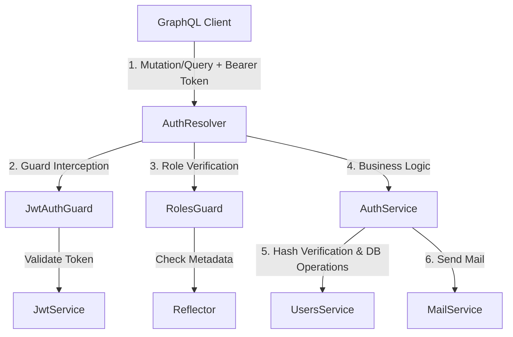

# Authentication & Authorization System Documentation

This document describes the complete flow of the Authentication (AuthN) and Authorization (AuthZ) systems in this NestJS application. It explains **how the system works**, **why specific tools/strategies were chosen**, and **how to explain these concepts in technical interviews**.

## 📖 Key Definitions: AuthN vs. AuthZ
In interviews, a common starter question is the difference between these two:
*   **Authentication (AuthN - *Who are you?*):** The process of verifying the identity of a user (e.g., matching email and password, verifying a JWT token).
*   **Authorization (AuthZ - *What are you allowed to do?*):** The process of verifying what resources or operations an authenticated user has permission to access (e.g., verifying if a user is an `ADMIN` or a `USER`).

---

## 🛠️ Tech Stack & Key Libraries Used
1.  **NestJS**: The underlying progressive Node.js framework.
2.  **GraphQL & `@nestjs/graphql`**: API architecture pattern. GraphQL requires different context handling than REST.
3.  **JSON Web Tokens (`@nestjs/jwt` & `jsonwebtoken`)**: Used for stateless session management.
4.  **Bcrypt (`bcryptjs`)**: A key-derivation function used for secure password hashing.
5.  **Crypto (Node.js Built-in)**: Used to generate cryptographically secure random tokens for password resets.
6.  **Prisma ORM (`@prisma/client`)**: Used to query and update the database (Users, Roles).

---

## 📐 Architecture Overview
The auth module is structured into cohesive layers following NestJS clean-architecture principles:

### 1. The Module: [auth.module.ts](file:///c:/zaibi's project/server/src/auth/auth.module.ts)
*   **Purpose:** Configures and registers dependencies.
*   **Key Detail:** Asynchronously registers `JwtModule` with environment variables (`JWT_SECRET`, `JWT_EXPIRY`) using `registerAsync` and dependency injection (`ConfigService`). This ensures database configuration is loaded before the token service starts.

### 2. The Controller: [auth.resolver.ts](file:///c:/zaibi's project/server/src/auth/auth.resolver.ts)
*   **Purpose:** Exposes public and private GraphQL mutations (Register, Login, ForgotPassword, ResetPassword, ChangePassword).
*   **Key Detail:** Protects specific mutations using decorators like `@UseGuards(JwtAuthGuard)` and leverages parameter decorators like `@CurrentUser()`.

### 3. The Service: [auth.service.ts](file:///c:/zaibi's project/server/src/auth/auth.service.ts)
*   **Purpose:** House the core business logic (credential comparison, token signing, reset token generation, password updating).
*   **Key Detail:** Uses `bcrypt.compare` and `bcrypt.hash` to verify and store credentials safely.

### 4. Guards & Decorators: [guards/](file:///c:/zaibi's project/server/src/auth/guards) & [decorators/](file:///c:/zaibi's project/server/src/auth/decorators)
*   `JwtAuthGuard`: Extracts the Bearer token from headers, verifies it, and attaches the payload (`req.user`) to the request context.
*   `RolesGuard`: Uses the `Reflector` to check for role metadata on the resolver handler and compares the user's role to the required roles.
*   `@CurrentUser()`: Param decorator to cleanly access the authenticated user object in resolver arguments.
*   `@Roles()`: Attaches metadata to specify which user roles can access a resolver.

---

## 🔄 Detailed Workflows

### A. Registration & Login Flow
1.  **Register:**
    *   Client sends a `register` mutation with username, email, and password.
    *   `AuthService` delegates to `UsersService` to hash the password and insert it into the database.
2.  **Login:**
    *   Client sends `login` mutation.
    *   `AuthService` fetches user by email.
    *   **Credential Verification:** Passes plain password and hashed database password into `bcrypt.compare()`.
    *   **Token Generation:** If valid, signs a JWT containing the payload: `{ id, email, role }`.
    *   Returns the signed token and user profile object to the client.

### B. Authenticated Request Authorization Flow
For protected endpoints (e.g., `changePassword` or Admin actions):
1.  The client puts the token in the HTTP Header: `Authorization: Bearer <TOKEN>`.
2.  **`JwtAuthGuard` Interception:**
    *   Since it is GraphQL, it converts NestJS execution context into GraphQL context using `GqlExecutionContext.create(context)`.
    *   Extracts request header: `req.headers.authorization`.
    *   Verifies the token using `JwtService.verifyAsync()`.
    *   Attaches the decoded payload (`id`, `email`, `role`) directly to `req.user`.
3.  **`RolesGuard` Verification:**
    *   Reads target metadata using `reflector.getAllAndOverride`.
    *   If no roles are configured, it returns `true` (access allowed).
    *   If roles are configured, it validates if `req.user.role` is one of the allowed roles. If not, it throws a `ForbiddenException`.

### C. Forgot & Reset Password Flow (Secure Implementation)
1.  **Request Reset:**
    *   User inputs email via `forgotPassword` mutation.
    *   Server generates a cryptographically secure token: `crypto.randomBytes(32).toString('hex')`.
    *   Calculates an expiration date (current time + 1 hour).
    *   Saves the token and expiry date to the database for that user.
    *   Sends an email to the user with a link containing the unique token.
2.  **Execute Reset:**
    *   User clicks the link and submits a new password along with the token.
    *   `AuthService` finds the user associated with that token.
    *   Checks if the token has expired.
    *   If valid, hashes the new password with a salt round of 10 (`bcrypt.hash(password, 10)`), stores it, and clears the token/expiry (`null`) in the database to prevent reuse.

---

## 🎯 Interview Q&A Cheatsheet
Here are top interview questions directly relevant to this codebase and how you should answer them:

### Q1: Why do we use JWT (JSON Web Tokens) instead of traditional Cookie/Session-based authentication?
*   **Answer:**
    *   **Statelessness & Scalability:** Standard sessions require the server to store session data in memory (like Redis) or database to verify requests. JWT is stateless; all authorization info (payload) is encoded within the token itself. The server only needs to cryptographically verify the signature of the token, saving memory/DB roundtrips and enabling horizontal scaling across multiple servers.
    *   **Decoupled Architecture:** Ideal for mobile apps and single-page apps (SPAs). It avoids CSRF vulnerabilities inherent in automatic cookie transmissions (though JWTs stored in local storage can be vulnerable to XSS; best practice is storing them in `HttpOnly` cookies if web-only, or secure keychain on mobile).

### Q2: Why do you hash passwords using Bcrypt instead of MD5, SHA-256, or encrypting them?
*   **Answer:**
    *   **Encryption is reversible (Two-way):** If an attacker gets the decryption key, they can decrypt all passwords. Hashing is one-way (irreversible).
    *   **Why Bcrypt over fast hashes (SHA-256/MD5):** Fast hashing algorithms are designed to be extremely quick. Attackers can brute-force them easily (millions of guesses per second). Bcrypt is a **slow hashing algorithm** (Key Derivation Function) that incorporates a work factor (cost). This makes brute-force attacks computationally infeasible and expensive.
    *   **Salt:** Bcrypt automatically generates a unique salt for each password. This prevents **Rainbow Table attacks** (precomputed hash lookup tables) and ensures two users with the same password will have entirely different hashes.

### Q3: Explain how your guards work in a GraphQL environment compared to a REST environment.
*   **Answer:**
    *   In a standard NestJS REST application, request headers are read from the standard HTTP request object (`context.switchToHttp().getRequest()`).
    *   In GraphQL, requests are bundled into a single HTTP POST request targeting `/graphql`. Thus, we must convert the NestJS `ExecutionContext` into a `GqlExecutionContext` using `GqlExecutionContext.create(context)`.
    *   From there, we extract the request context `ctx.getContext().req` which holds headers like `authorization` and can store the authenticated user entity (`req.user`).

### Q4: Why is it important to nullify the password reset token after resetting the password?
*   **Answer:**
    *   **Replay Attacks:** If the reset token is not cleared, an attacker who gains access to the user's email history could reuse that token to reset the password again. By nullifying both the `resetToken` and `resetTokenExpiry` immediately upon a successful reset, the token is invalidated forever (it becomes one-time-use).

### Q5: What is the purpose of the `Reflector` in your `RolesGuard`?
*   **Answer:**
    *   `Reflector` is a NestJS utility helper used to retrieve metadata associated with a specific class or handler (method).
    *   When we apply `@Roles(Role.ADMIN)` to a resolver, NestJS attaches that role array as metadata using `SetMetadata`.
    *   In the `RolesGuard`, the `Reflector` retrieves that metadata. We use `reflector.getAllAndOverride` to check if metadata is set on the handler level first (which overrides class level) and match it against the incoming user's role payload.

---

## 🔒 Security Best Practices Checklist (Implemented in this project)
*   [x] **Never store raw passwords:** All passwords are run through `bcrypt`.
*   [x] **Environment-based secrets:** JWT Secret is loaded via `ConfigService` (`process.env.JWT_SECRET`).
*   [x] **Short-lived tokens:** Expiration time is configured (e.g., `1d` or less) to limit vulnerability window if a token is intercepted.
*   [x] **Secure reset tokens:** Uses Node's cryptographically secure pseudo-random number generator (`crypto`) instead of predictable numbers like `Math.random()`.
*   [x] **Expired tokens rejected:** Timestamps are saved alongside reset tokens and checked during verification.
